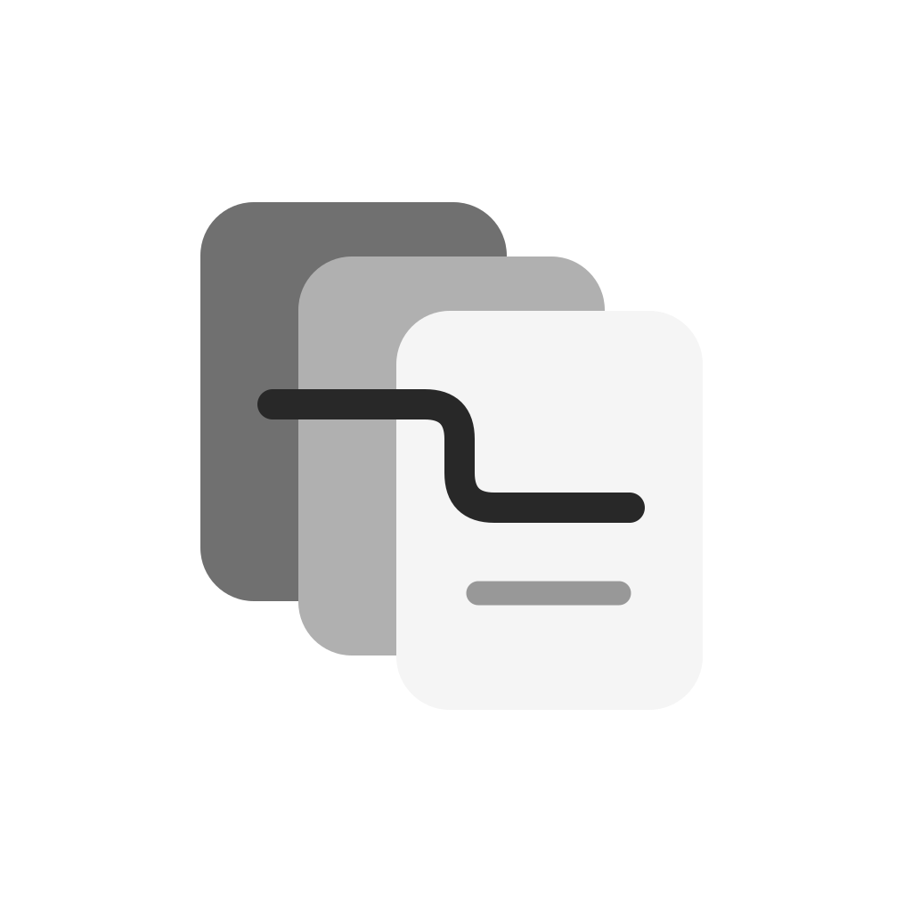

# Shared Memory

**Shared notes for people and AI agents. Edit them normally.**

Shared Memory 0.3.0 works in an ordinary Markdown folder. People and agents save
changes directly, including offline. Your chosen folder provider transports the
files when connected; Shared Memory records changes and reconciles the history it
can see. Optional reviews happen after editing. A designated integrator, approval
queue or always-online reviewer is not required.

Obsidian is optional. One shared project subfolder can live inside an existing
private vault. The enclosing vault, private notes and settings stay outside that
project's boundary.

[Workflow, offline conflicts and provider diagrams](docs/DIAGRAMS.md)

## Get started

1. [Paste the setup prompt](SETUP-PROMPT.md) into an agent connected to your computer.
2. Select the folder and use its existing sharing provider, if any.
3. Let the agent finish setup, then edit your notes normally.

Local use needs Python 3.11+ and the verified runtime; no account or server is
required. For another person, grant the intended folder access through your chosen
provider and have their agent set up that local copy. Each computer keeps its own
private baseline. Do not copy another person's private state.

[Release v0.3.0](https://github.com/Kian-hdr/shared-memory/releases/tag/v0.3.0) is the
version-specific download location. Execute only assets actually present there and
verified against its external `SHA256SUMS`, or an explicitly supplied reviewed
candidate. The expected runtime is `shared-memory-0.3.0.pyz`; the matching full kit,
setup prompt, optional skill and icons are separate assets. A download does not grant
access to another person's folders.

## Save, reconnect, reconcile

- Edit Markdown with your existing editor or agent. Saving persists locally.
- Run `sync` after edits and again when provider files arrive. The agent can do this
  as part of its work; the command itself is not a permanently running watcher.
- Compatible text changes can merge. Conflicting versions remain recoverable and
  need an explicit resolution with evidence from an authorized editor.
- A clean textual merge does not prove factual agreement. Review contradictions
  in meaning when they matter; record corrections without pretending software
  approved them.
- Deletions and renames need their explicit history operations, so temporary
  provider absence is not silently treated as intentional deletion.

Capture before reconnect when practical. A provider can overwrite a version before
Shared Memory records it; such uncaptured work needs provider history or backups.

Shared history contains readable project content and immutable event records,
not SQLite or login credentials. Provider permissions and explicit read-only
configuration still apply. History hashes are integrity checks, not independent
proof of an editor's real-world identity or the truth of a note.

Choose **one provider per folder**: Google Drive, iCloud Drive, OneDrive, or an
operator-managed Nextcloud service. Shared Memory does not bridge these services
or provision a server automatically. [Provider guidance](docs/PROVIDERS.md) covers
offline files, conflict copies and the recommended first self-hosted option.

## Existing projects and evidence

Formats 1 and 2 belong to the older coordinator workflow. Keep that workflow
explicitly, or use the documented migration with a fresh private backup. Setup
never silently deletes its database/history or converts it into folder mode.
See [the operating guide](docs/PRODUCT-V1.md), [everyday work](docs/COLLABORATION.md),
and [the historical coordinator manual](docs/COORDINATOR-WORKFLOW.md).

[Validation](VALIDATION.md) distinguishes local fixtures and earlier coordinator CI
from actual provider and independent-device acceptance. A local sync result is not
a receipt from every remote recipient. The package is not a hosted service, native
app, editor lock, permission bypass or universal semantic conflict detector.

## License

[MIT](LICENSE). The [legacy toolkit](docs/SETUP.md#legacy-advisory-tracker-setup)
remains available explicitly; it is not the normal folder workflow.
