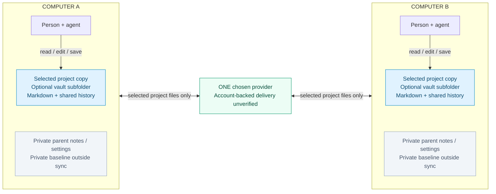
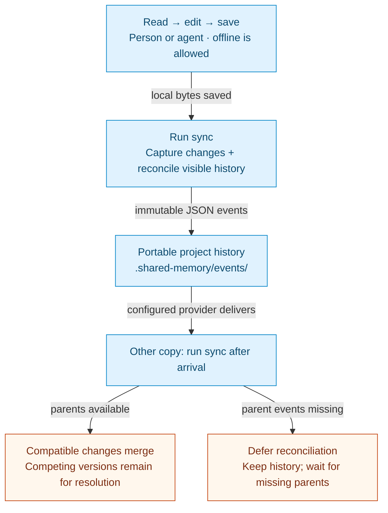
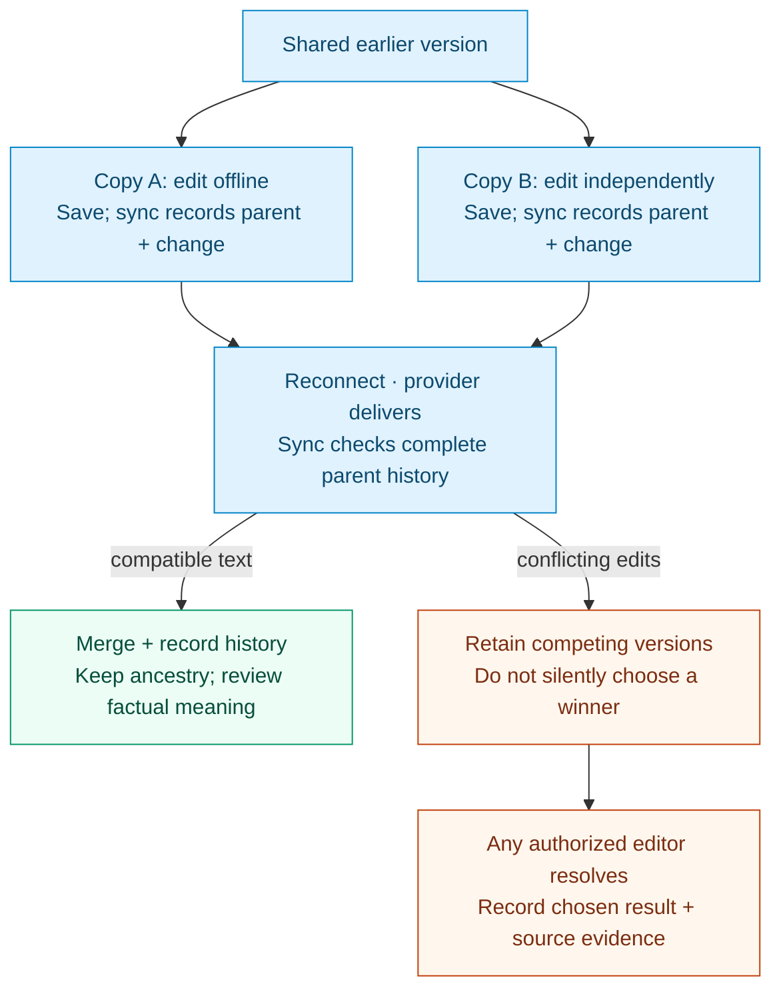
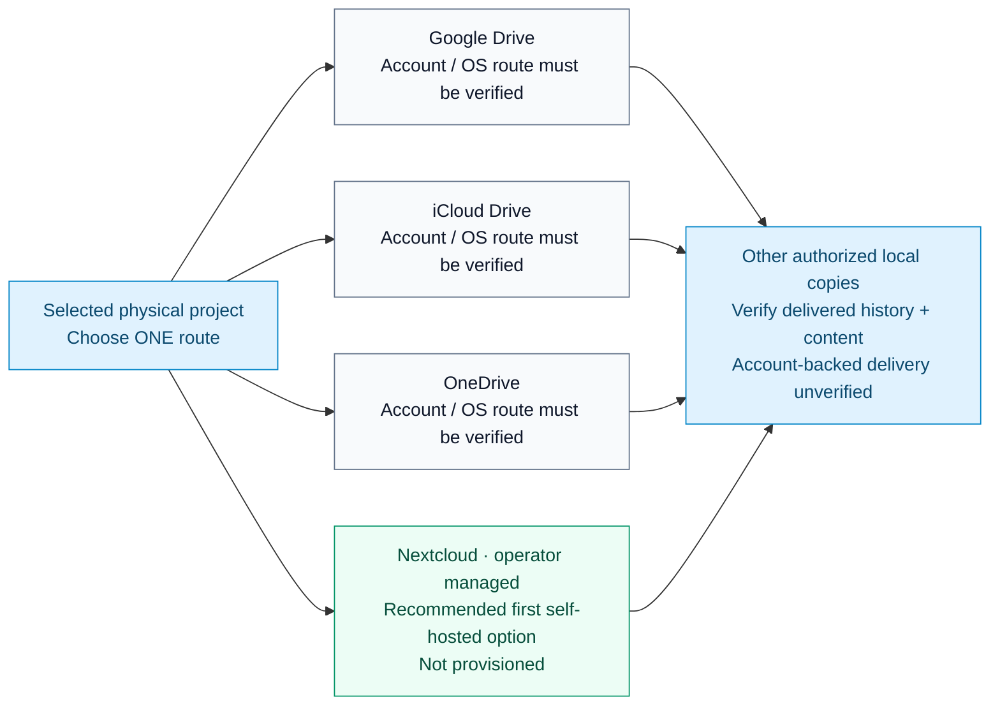

# Shared Memory diagrams

These figures explain the developing **0.3.0 folder workflow**, not the older
format-1/2 coordinator. They are design and operating illustrations, not evidence
of provider delivery, independent-device acceptance or a published release. Read
the [operating guide](PRODUCT-V1.md) and [provider guidance](PROVIDERS.md) for current
commands and limits.

The `.mmd` files are the editable source of truth. The Mermaid blocks below and
SVG fallbacks are generated from those same files. GitHub and Mermaid-enabled
Obsidian views can render the fenced blocks directly; other readers can use the
SVGs. Edit the `.mmd` source and regenerate, rather than editing a generated block.
The README also uses generated Mermaid blocks, with fixed color classes omitted
so GitHub can choose light or dark presentation. The checker verifies both the
README and this guide against the same `.mmd` sources. SVGs remain optional image
fallbacks; do not maintain independent copies of the diagrams.

## 1. Separate local copies, one selected project

<!-- BEGIN GENERATED MERMAID: 01-shared-folder.mmd -->

<!-- END GENERATED MERMAID: 01-shared-folder.mmd -->

<details>
<summary>SVG fallback</summary>


</details>

[Editable Mermaid](../assets/diagrams/01-shared-folder.mmd)

Each computer has its own selected project copy and private baseline. An optional
private Obsidian vault can surround that folder. Arrows through the provider carry
only selected project files and portable history; disconnected private boxes have
no delivery arrow. Provider permissions still determine access. Folder selection
does not create sharing permissions or prove that arbitrary note content is safe
to share. No database, login credential or agent transcript belongs in the exchange.

## 2. Direct editing and history exchange

<!-- BEGIN GENERATED MERMAID: 02-edit-and-deliver.mmd -->

<!-- END GENERATED MERMAID: 02-edit-and-deliver.mmd -->

<details>
<summary>SVG fallback</summary>



</details>

[Editable Mermaid](../assets/diagrams/02-edit-and-deliver.mmd)

People and agents save directly without an approval queue or designated integrator.
Saving persists local bytes; history capture happens when `sync` runs. Local edits
are captured against the private baseline before incoming history is reconciled. The chosen
provider delivers files separately. Run `sync` again after arrivals. An inactive
agent does not automatically wake, renew ownership or notice changes. Missing
parent events defer the whole affected event, including multi-path changes; absence
alone is not an intentional deletion.
Use the explicit deletion and rename operations to record those intentions.

## 3. Offline work and conflicts

<!-- BEGIN GENERATED MERMAID: 03-offline-and-conflicts.mmd -->

<!-- END GENERATED MERMAID: 03-offline-and-conflicts.mmd -->

<details>
<summary>SVG fallback</summary>



</details>

[Editable Mermaid](../assets/diagrams/03-offline-and-conflicts.mmd)

The two branches share a known parent, not a clock-based winner. After complete
history arrives, compatible text can merge. Competing versions remain recoverable
in immutable history, with readable `.shared-memory/conflicts/` reports, until an
authorized editor records an explicit resolution and its evidence.
No special integrator role is required in normal folder mode. Read-only settings
and provider access restrictions still apply. A clean text merge does not prove
factual agreement; people and agents must check consequential claims against sources.
History hashes establish content integrity, not independently authenticated human
identity. Preserve provider conflict copies and unrelated edits.

## 4. Provider alternatives

<!-- BEGIN GENERATED MERMAID: 04-provider-options.mmd -->

<!-- END GENERATED MERMAID: 04-provider-options.mmd -->

<details>
<summary>SVG fallback</summary>



</details>

[Editable Mermaid](../assets/diagrams/04-provider-options.mmd)

The four branches are alternatives: choose **one provider for each physical project
folder**. They are not bridges between providers. Nextcloud is the recommended first
self-hosted option in this design; no service is provisioned by this diagram or by
ordinary local setup. Account type, client, OS, offline availability and provider
conflict behavior need their own validation. Account-backed delivery tests for this
folder workflow are not yet available. No identical provider/OS support is claimed.
Local-only use remains possible without any provider or server.

## Regenerate and review

Check or regenerate the fenced Markdown blocks with standard-library Python only:

```sh
python3 scripts/render_diagrams.py --check-markdown
python3 scripts/render_diagrams.py --update-markdown
```

The check exits nonzero if any generated block differs from its source or its
markers are missing/duplicated. It does not run Node, launch a browser or write files.
The update changes only the marked regions, preserving captions and SVG fallbacks.

Rendering is a documentation-development step, not a runtime dependency. Use
Mermaid CLI **11.17.0**, Node.js and an existing compatible Chrome/Chromium:

```sh
# Install development-only tooling in a private temporary directory.
PUPPETEER_SKIP_DOWNLOAD=true npm install --prefix /tmp/shared-memory-diagram-tools --no-audit --no-fund @mermaid-js/mermaid-cli@11.17.0

# Run from this repository. Replace the browser path for the actual computer.
python3 scripts/render_diagrams.py \
  --mmdc /tmp/shared-memory-diagram-tools/node_modules/.bin/mmdc \
  --chrome "/path/to/Chrome-or-Chromium" \
  --png-dir /tmp/shared-memory-diagram-previews
```

The renderer processes each `.mmd` with Mermaid, rejecting syntax/render failures,
and writes the matching SVG. After successful rendering it also updates the generated
Markdown blocks. `--output-dir` can target a fresh SVG comparison directory.
PNG previews are optional and stay outside the repository. Inspect all figures for
readable text, clipping, arrow direction and faithful boundaries after changing a
source. Font/browser differences can affect layout; generated output is reviewed
artwork, not a promise of identical bytes on every renderer host.

For a surface that needs an image fallback, use the existing export:

```markdown


[Workflow, offline conflicts and provider diagrams](docs/DIAGRAMS.md)
```

Each SVG includes a title and description from Mermaid's accessibility fields. The
captions above supply the meaning and limitations without relying on color alone.
